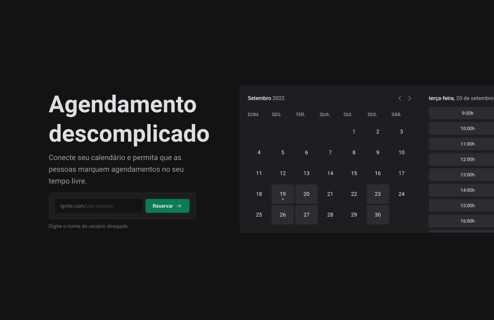
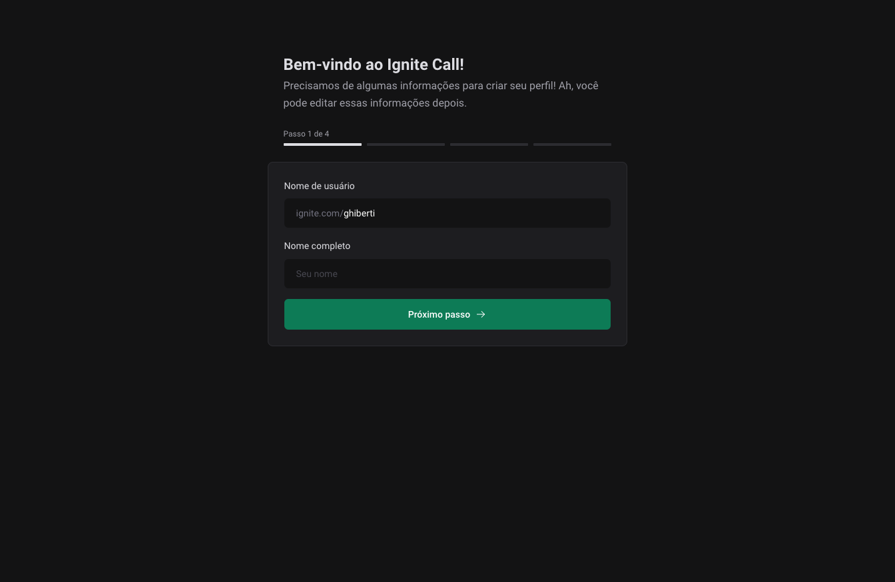
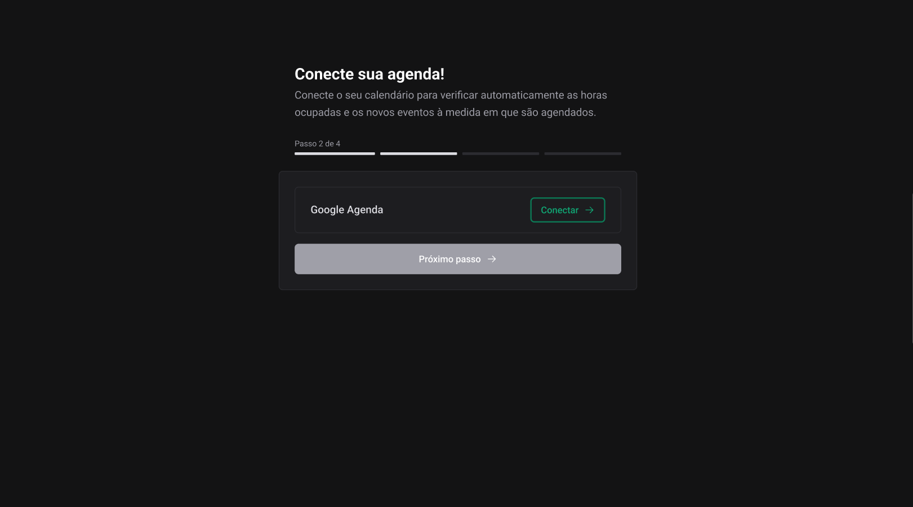
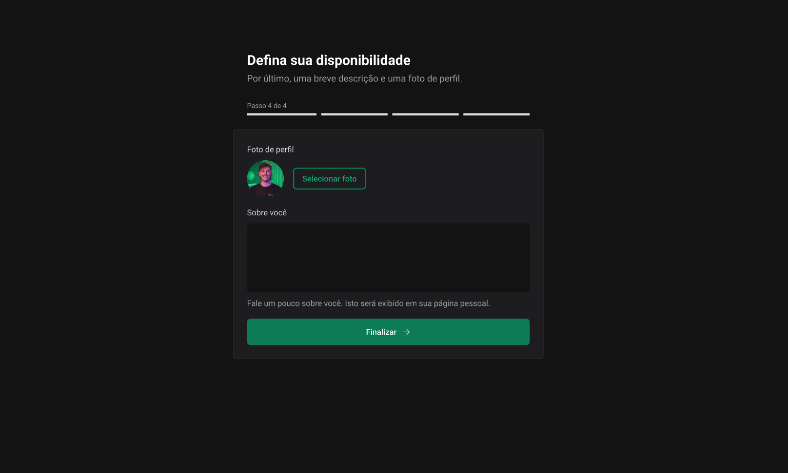
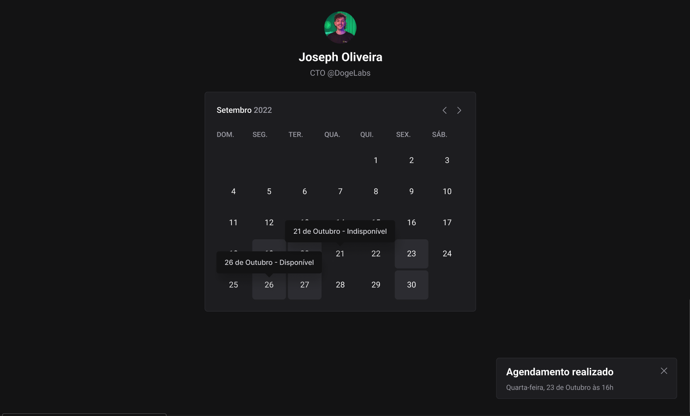
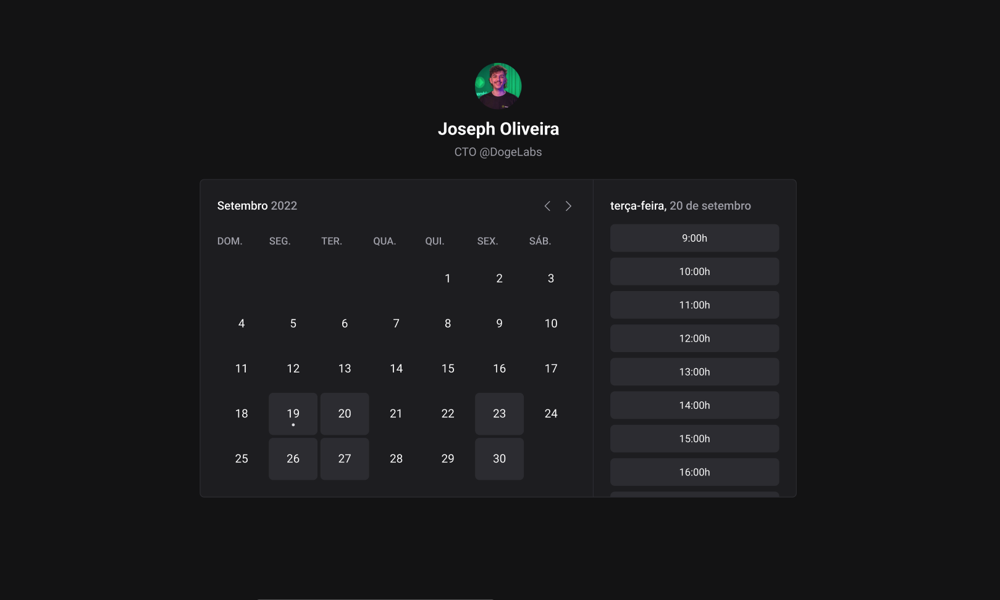
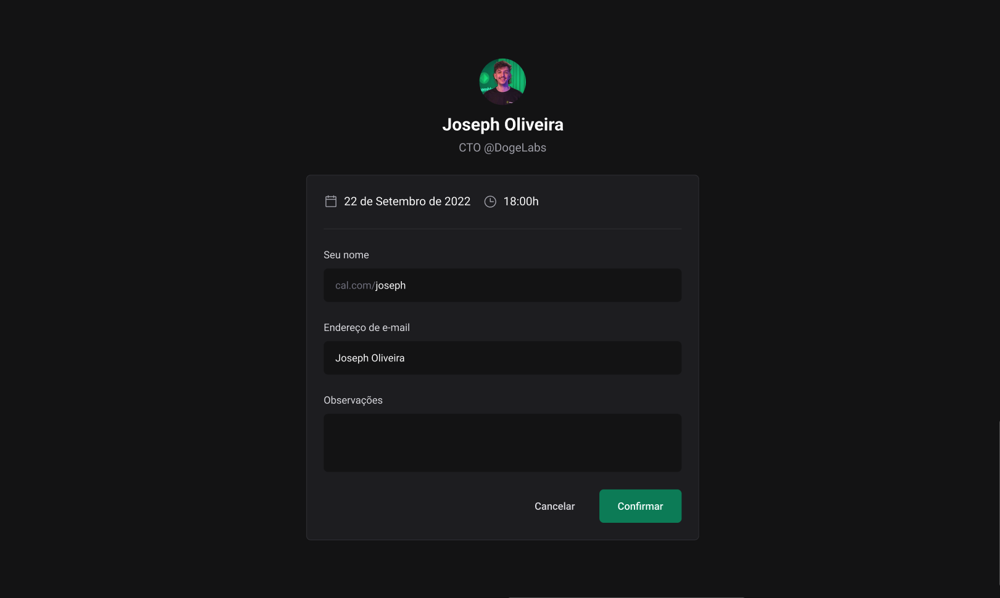

<h1 align="center">
    <strong>Ignite Call</strong>
</h1>

<p align="center">
 <a href="#-about">About</a> •
 <a href="#-features">Features</a> •
 <a href="#-deploy">Deploy</a> • 
 <a href="#-layout">Layout</a> • 
 <a href="#-technologies">Technologies</a> • 
 <a href="#-install">Install</a>
</p>

## 💻 About

Full Stack Project with Next.js and React. Seamlessly integrate with Google Calendar to schedule appointments. Simplify time management and enhance communication with this user-friendly scheduling application.


## ☑ Features

- [x] User Registration: Easy sign-up using username and Gmail.
- [x] Google Calendar Integration: Sync schedules effortlessly.
- [x] Customizable Schedule: Personalize availability by day and time.
- [x] User Notifications: Stay on track with timely reminders.


## 🌐 Deploy

- [ignitecall-ghiberti85.vercel.app](https://ignitecall-ghiberti85.vercel.app/)


## 🎨 Layout

> Check Figma [Figma](https://www.figma.com/file/4guh8JW2fjRFtiZyP92HcS/Ignite-Call-(Community)?type=design&node-id=339-74&mode=design&t=85Im3crae7NUiE6b-0)


### Registration

<p align="left"> 
  
</p>

<br>

<p align="left">       
  
</p>

<br>

<p align="left">       
  

<br>

<p align="left">       
  
</p>

<br>

<p align="left">       
  
</p>


### Calendar

<p align="left">       
  
</p>

<br>

<p align="left">       
  
</p>

<br>

<p align="left">       
  
</p>


## 🔨 Technologies

The following tools were used to build the project:

- **[ReactJS](https://reactjs.org/)**
- **[TypeScript](https://www.typescriptlang.org/)**
- **[Styled Components](https://styled-components.com/docs)**
- **[NextJs](https://nextjs.org/)**

> Check file [package.json](https://github.com/ghiberti85/ignite-call/blob/main/package.json)


## 🚀 Install

```bash
# Cloning repository
git clone https://github.com/ghiberti85/ignite-call.git

# Access project's folder
cd ignite-call

# Install dependencies
npm i

# Run application
npm run dev

```

---

Made with 💜 by [Fernando Ghiberti](https://github.com/ghiberti85)